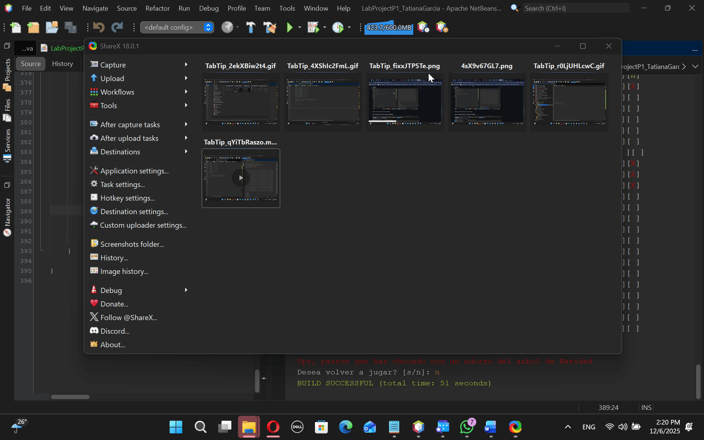

## Ejecucion y Sugerencias del Proyecto

#### Happy Path

#### Sad Path

Pueden ver el video en los archivos del repo.

## Instrucciones de Proyecto

### CLonar el Proyecto 
En su git bash dentro de la carpeta donde quieren guardar su proyecto usar el siguiente comando
` git clone https://github.com/Tatiana-Garcia/LabProject1_NP `

Luego abrir el proyecto en Netbeans y cambiarle el nombre de la siguiente forma:
#### How to change the name of a project in Netbeans:

